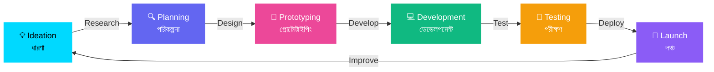

<div align="center">

<!-- Glassmorphism Banner with Wave Animation -->


<!-- Profile Picture Section with Glassmorphism & Animation -->
<div align="center">
  <picture>
    <source media="(prefers-color-scheme: dark)" srcset="https://readme-typing-svg.demolab.com?font=Fira+Code&weight=700&size=18&duration=3000&pause=1000&color=00D9FF&center=true&vCenter=true&multiline=false&repeat=true&width=600&height=30&lines=✨+Welcome+to+my+Digital+Universe+✨;✨+আমার+ডিজিটাল+জগতে+স্বাগতম+✨">
    <source media="(prefers-color-scheme: light)" srcset="https://readme-typing-svg.demolab.com?font=Fira+Code&weight=700&size=18&duration=3000&pause=1000&color=6366F1&center=true&vCenter=true&multiline=false&repeat=true&width=600&height=30&lines=✨+Welcome+to+my+Digital+Universe+✨;✨+আমার+ডিজিটাল+জগতে+স্বাগতম+✨">
    
  </picture>
  
  <br/>
  
  <!-- Animated Profile Picture with Glassmorphism Border -->
  
  
  <!-- You can also use a custom profile image URL -->
  <!--  -->
  
  <br/><br/>
  
  <!-- Gradient Name with Glass Effect -->
  <h1>
    <picture>
      <source media="(prefers-color-scheme: dark)" srcset="https://readme-typing-svg.demolab.com?font=Orbitron&weight=900&size=48&duration=2000&pause=1000&color=00D9FF&center=true&vCenter=true&multiline=false&repeat=false&width=500&height=80&lines=TONMOY">
      <source media="(prefers-color-scheme: light)" srcset="https://readme-typing-svg.demolab.com?font=Orbitron&weight=900&size=48&duration=2000&pause=1000&color=6366F1&center=true&vCenter=true&multiline=false&repeat=false&width=500&height=80&lines=TONMOY">
      
    </picture>
  </h1>
  
  <!-- Animated Role/Title with Gradient Text -->
  <picture>
    <source media="(prefers-color-scheme: dark)" srcset="https://readme-typing-svg.demolab.com?font=Fira+Code&weight=600&size=28&duration=3000&pause=1000&color=00D9FF&center=true&vCenter=true&multiline=false&repeat=true&width=700&height=80&lines=🎨+Creative+Web+Designer;💻+Full+Stack+Developer;🚀+UI%2FUX+Enthusiast;✨+Digital+Innovator;🎨+সৃজনশীল+ওয়েব+ডিজাইনার;💻+ফুল+স্ট্যাক+ডেভেলপার;🚀+UI%2FUX+উৎসাহী;✨+ডিজিটাল+উদ্ভাবক">
    <source media="(prefers-color-scheme: light)" srcset="https://readme-typing-svg.demolab.com?font=Fira+Code&weight=600&size=28&duration=3000&pause=1000&color=6366F1&center=true&vCenter=true&multiline=false&repeat=true&width=700&height=80&lines=🎨+Creative+Web+Designer;💻+Full+Stack+Developer;🚀+UI%2FUX+Enthusiast;✨+Digital+Innovator;🎨+সৃজনশীল+ওয়েব+ডিজাইনার;💻+ফুল+স্ট্যাক+ডেভেলপার;🚀+UI%2FUX+উৎসাহী;✨+ডিজিটাল+উদ্ভাবক">
    
  </picture>
  
  <br/>
  
  <!-- Animated Badges with Glassmorphism -->
  <p align="center">
    
    
    
    
  </p>
  
  <!-- Gradient Line Separator -->
  
  
</div>

<br/>

</div>

<!-- Glassmorphism About Me Card -->
<div align="center">
  
### 🌟 About Me | আমার সম্পর্কে

<table>
<tr>
<td width="50%" valign="top">

#### 🇬🇧 English

```typescript
const webDeveloper = {
  name: "Tonmoy",
  role: "Full Stack Web Developer & Designer",
  location: "🌍 Bangladesh",
  languages: ["JavaScript", "TypeScript", "Python", "Bengali", "English"],
  specialization: [
    "🎨 UI/UX Design",
    "💻 Web Development",
    "🚀 Performance Optimization",
    "📱 Responsive Design",
  ],
  currentFocus: "Building beautiful & functional web experiences",
  funFact: "I turn ☕ into code and designs into reality!",
};
```

</td>
<td width="50%" valign="top">

#### 🇧🇩 বাংলা

```typescript
const ওয়েবডেভেলপার = {
  নাম: "তন্ময়",
  ভূমিকা: "ফুল স্ট্যাক ওয়েব ডেভেলপার ও ডিজাইনার",
  অবস্থান: "🌍 বাংলাদেশ",
  ভাষা: ["জাভাস্ক্রিপ্ট", "টাইপস্ক্রিপ্ট", "পাইথন", "বাংলা", "ইংরেজি"],
  বিশেষত্ব: [
    "🎨 UI/UX ডিজাইন",
    "💻 ওয়েব ডেভেলপমেন্ট",
    "🚀 পারফরম্যান্স অপটিমাইজেশন",
    "📱 রেসপন্সিভ ডিজাইন",
  ],
  বর্তমানফোকাস: "সুন্দর ও কার্যকর ওয়েব অভিজ্ঞতা তৈরি করা",
  মজারতথ্য: "আমি ☕ কে কোডে এবং ডিজাইনকে বাস্তবে রূপান্তরিত করি!",
};
```

</td>
</tr>
</table>

</div>

---

<!-- Animated Skills Section with Glassmorphism -->
<div align="center">

## 💻 Tech Stack | প্রযুক্তি স্ট্যাক

### 🎨 Frontend Development

<p align="center">
  
  
  
  
  
  
  
  
  
  
</p>

### ⚙️ Backend Development

<p align="center">
  
  
  
  
  
  
</p>

### 🗄️ Database & Cloud

<p align="center">
  
  
  
  
  
  
</p>

### 🎨 Design Tools

<p align="center">
  
  
  
  
  
</p>

### 🛠️ Tools & Technologies

<p align="center">
  
  
  
  
  
  
</p>

</div>

---

<!-- GitHub Stats with Glassmorphism -->
<div align="center">

## 📊 GitHub Statistics | গিটহাব পরিসংখ্যান

<picture>
  <source media="(prefers-color-scheme: dark)" srcset="https://github-readme-stats.vercel.app/api?username=Tonmoy&show_icons=true&theme=transparent&hide_border=true&title_color=00d9ff&icon_color=00d9ff&text_color=ffffff&bg_color=00000000&border_radius=15" />
  <source media="(prefers-color-scheme: light)" srcset="https://github-readme-stats.vercel.app/api?username=Tonmoy&show_icons=true&theme=default&hide_border=true&title_color=6366f1&icon_color=6366f1&text_color=000000&bg_color=00000000&border_radius=15" />
  
</picture>

<picture>
  <source media="(prefers-color-scheme: dark)" srcset="https://github-readme-streak-stats.herokuapp.com/?user=Tonmoy&theme=transparent&hide_border=true&ring=00d9ff&fire=00d9ff&currStreakLabel=00d9ff&sideNums=ffffff&sideLabels=ffffff&dates=ffffff&background=00000000&border_radius=15" />
  <source media="(prefers-color-scheme: light)" srcset="https://github-readme-streak-stats.herokuapp.com/?user=Tonmoy&theme=default&hide_border=true&ring=6366f1&fire=6366f1&currStreakLabel=6366f1&sideNums=000000&sideLabels=000000&dates=000000&background=00000000&border_radius=15" />
  
</picture>

<picture>
  <source media="(prefers-color-scheme: dark)" srcset="https://github-readme-stats.vercel.app/api/top-langs/?username=Tonmoy&layout=compact&theme=transparent&hide_border=true&title_color=00d9ff&text_color=ffffff&bg_color=00000000&border_radius=15&langs_count=8" />
  <source media="(prefers-color-scheme: light)" srcset="https://github-readme-stats.vercel.app/api/top-langs/?username=Tonmoy&layout=compact&theme=default&hide_border=true&title_color=6366f1&text_color=000000&bg_color=00000000&border_radius=15&langs_count=8" />
  
</picture>

### 🏆 GitHub Trophies | গিটহাব ট্রফি

<picture>
  <source media="(prefers-color-scheme: dark)" srcset="https://github-profile-trophy.vercel.app/?username=Tonmoy&theme=discord&no-frame=true&no-bg=true&margin-w=4&row=1&column=7" />
  <source media="(prefers-color-scheme: light)" srcset="https://github-profile-trophy.vercel.app/?username=Tonmoy&theme=flat&no-frame=true&no-bg=true&margin-w=4&row=1&column=7" />
  
</picture>

### 📈 Contribution Graph | অবদান গ্রাফ

<picture>
  <source media="(prefers-color-scheme: dark)" srcset="https://github-readme-activity-graph.vercel.app/graph?username=Tonmoy&theme=react-dark&hide_border=true&bg_color=00000000&color=00d9ff&line=00d9ff&point=ffffff&area=true&area_color=00d9ff" />
  <source media="(prefers-color-scheme: light)" srcset="https://github-readme-activity-graph.vercel.app/graph?username=Tonmoy&theme=minimal&hide_border=true&bg_color=00000000&color=6366f1&line=6366f1&point=000000&area=true&area_color=6366f1" />
  
</picture>

</div>

---

<!-- Animated Skills Progress Bars -->
<div align="center">

## 🎯 Skills Proficiency | দক্ষতার স্তর

<table>
<tr>
<td width="50%" valign="top">

### Design Skills | ডিজাইন দক্ষতা

```text
UI/UX Design        ████████████████████ 95%
Responsive Design   ███████████████████░ 92%
Graphic Design      ██████████████████░░ 88%
Animation           █████████████████░░░ 85%
Prototyping         ████████████████████ 90%
```

</td>
<td width="50%" valign="top">

### Development Skills | ডেভেলপমেন্ট দক্ষতা

```text
Frontend Dev        ████████████████████ 95%
Backend Dev         ██████████████████░░ 87%
Database Design     ███████████████████░ 90%
API Development     ██████████████████░░ 88%
DevOps              ████████████████░░░░ 80%
```

</td>
</tr>
</table>

</div>

---

<!-- Featured Projects with Glassmorphism -->
<div align="center">

## 🚀 Featured Projects | বৈশিষ্ট্যযুক্ত প্রকল্প

<table>
<tr>
<td width="50%">

### 🌐 Project 1

**Modern E-commerce Platform**


A fully responsive e-commerce platform with glassmorphism UI, dark mode support, and smooth animations.

[🔗 Live Demo](#) | [💻 Code](#)

</td>
<td width="50%">

### 🎨 Project 2

**Portfolio Website Builder**


Create stunning portfolio websites with drag-and-drop functionality and real-time preview.

[🔗 Live Demo](#) | [💻 Code](#)

</td>
</tr>

<tr>
<td width="50%">

### 📱 Project 3

**Social Media Dashboard**


Analytics dashboard with real-time data visualization and beautiful charts.

[🔗 Live Demo](#) | [💻 Code](#)

</td>
<td width="50%">

### 🛠️ Project 4

**Design System Library**


Reusable component library with comprehensive documentation and theming support.

[🔗 Live Demo](#) | [💻 Code](#)

</td>
</tr>
</table>

</div>

---

<!-- Animated Work Process -->
<div align="center">

## 🎨 My Creative Process | আমার সৃজনশীল প্রক্রিয়া



</div>

---

<!-- Services Offered -->
<div align="center">

## 💼 Services I Offer | আমার সেবাসমূহ

<table>
<tr>
<td align="center" width="33%">

### 🎨 Web Design

**ওয়েব ডিজাইন**

- UI/UX Design
- Responsive Layouts
- Wireframing
- Prototyping
- Brand Identity

</td>
<td align="center" width="33%">

### 💻 Web Development

**ওয়েব ডেভেলপমেন্ট**

- Frontend Development
- Backend Development
- Full Stack Solutions
- API Integration
- Database Design

</td>
<td align="center" width="33%">

### 🚀 Optimization

**অপটিমাইজেশন**

- Performance Tuning
- SEO Optimization
- Code Refactoring
- Security Audit
- Load Time Reduction

</td>
</tr>
</table>

</div>

---

<!-- Connect with me section -->
<div align="center">

## 🌐 Connect With Me | আমার সাথে যোগাযোগ করুন

<p align="center">
  <a href="https://linkedin.com/in/Tonmoy">
    
  </a>
  <a href="https://twitter.com/Tonmoy">
    
  </a>
  <a href="https://facebook.com/Tonmoy">
    
  </a>
  <a href="https://instagram.com/Tonmoy">
    
  </a>
  <a href="https://dribbble.com/Tonmoy">
    
  </a>
  <a href="https://behance.net/Tonmoy">
    
  </a>
  <a href="https://codepen.io/Tonmoy">
    
  </a>
  <a href="https://dev.to/Tonmoy">
    
  </a>
  <a href="mailto:tonmoy@example.com">
    
  </a>
  <a href="https://tonmoy.dev">
    
  </a>
</p>

### 📧 Get In Touch | যোগাযোগ করুন

<table>
<tr>
<td align="center" width="50%">

**🇬🇧 English**

📮 **Email:** tonmoy@example.com  
💬 **Discord:** Tonmoy#1234  
📱 **Phone:** +880 1XX-XXXXXXX  
🌐 **Website:** [tonmoy.dev](https://tonmoy.dev)

</td>
<td align="center" width="50%">

**🇧🇩 বাংলা**

📮 **ইমেইল:** tonmoy@example.com  
💬 **ডিসকর্ড:** Tonmoy#1234  
📱 **ফোন:** +৮৮০ 1XX-XXXXXXX  
🌐 **ওয়েবসাইট:** [tonmoy.dev](https://tonmoy.dev)

</td>
</tr>
</table>

</div>

---

<!-- Spotify Now Playing -->
<div align="center">

## 🎵 Currently Vibing To | এখন যা শুনছি

<picture>
  <source media="(prefers-color-scheme: dark)" srcset="https://spotify-github-profile.kittinanx.com/api/view?uid=Tonmoy&cover_image=true&theme=novatorem&show_offline=false&background_color=121212&interchange=false&bar_color=00d9ff&bar_color_cover=true">
  <source media="(prefers-color-scheme: light)" srcset="https://spotify-github-profile.kittinanx.com/api/view?uid=Tonmoy&cover_image=true&theme=default&show_offline=false&background_color=ffffff&interchange=false&bar_color=6366f1&bar_color_cover=true">
  
</picture>

</div>

---

<!-- Random Dev Quote -->
<div align="center">

## 💭 Quote of the Day | আজকের উক্তি

<picture>
  <source media="(prefers-color-scheme: dark)" srcset="https://quotes-github-readme.vercel.app/api?type=horizontal&theme=tokyonight&border=true">
  <source media="(prefers-color-scheme: light)" srcset="https://quotes-github-readme.vercel.app/api?type=horizontal&theme=default&border=true">
  
</picture>

</div>

---

<!-- Fun Facts & Interests -->
<div align="center">

## 🎯 Fun Facts & Interests | মজার তথ্য ও আগ্রহ

<table>
<tr>
<td width="50%" valign="top">

### 🇬🇧 English

- 🎮 **Hobbies:** Gaming, Photography, Music
- 🌱 **Learning:** Web3, AI/ML, Cloud Architecture
- 💡 **Interests:** Open Source, Tech Blogging
- ⚡ **Fun Fact:** I debug in my sleep!
- 🎯 **Goal:** Build products that make a difference
- 📚 **Reading:** Design Patterns & Clean Code
- ☕ **Coffee:** 5 cups/day (minimum!)

</td>
<td width="50%" valign="top">

### 🇧🇩 বাংলা

- 🎮 **শখ:** গেমিং, ফটোগ্রাফি, সঙ্গীত
- 🌱 **শিখছি:** ওয়েব৩, এআই/এমএল, ক্লাউড আর্কিটেকচার
- 💡 **আগ্রহ:** ওপেন সোর্স, টেক ব্লগিং
- ⚡ **মজার তথ্য:** আমি ঘুমের মধ্যে ডিবাগ করি!
- 🎯 **লক্ষ্য:** পার্থক্য সৃষ্টিকারী পণ্য তৈরি করা
- 📚 **পড়ছি:** ডিজাইন প্যাটার্ন ও ক্লিন কোড
- ☕ **কফি:** দিনে ৫ কাপ (ন্যূনতম!)

</td>
</tr>
</table>

</div>

---

<!-- Recent Blog Posts -->
<div align="center">

## 📝 Latest Blog Posts | সাম্প্রতিক ব্লগ পোস্ট

<!-- BLOG-POST-LIST:START -->

- 🎨 [Creating Stunning Glassmorphism Effects in CSS](#)
- 🚀 [10 Performance Optimization Tips for React Apps](#)
- 💡 [Building a Design System from Scratch](#)
- 🌙 [Implementing Dark Mode in Next.js](#)
- 📱 [Responsive Design Best Practices in 2024](#)
<!-- BLOG-POST-LIST:END -->

▶ [View All Posts](#)

</div>

---

<!-- Profile Views Counter -->
<div align="center">

## 👀 Profile Views | প্রোফাইল ভিউ

<picture>
  <source media="(prefers-color-scheme: dark)" srcset="https://komarev.com/ghpvc/?username=Tonmoy&label=Profile%20Views&color=00d9ff&style=for-the-badge">
  <source media="(prefers-color-scheme: light)" srcset="https://komarev.com/ghpvc/?username=Tonmoy&label=Profile%20Views&color=6366f1&style=for-the-badge">
  
</picture>

### ⭐ Star Rating | স্টার রেটিং


</div>

---

<!-- Support Section -->
<div align="center">

## 💖 Support My Work | আমার কাজ সমর্থন করুন

<table>
<tr>
<td align="center" width="33%">

### ☕ Buy Me a Coffee

<a href="https://www.buymeacoffee.com/Tonmoy">
  
</a>

</td>
<td align="center" width="33%">

### 💝 PayPal

<a href="https://paypal.me/Tonmoy">
  
</a>

</td>
<td align="center" width="33%">

### 🌟 GitHub Sponsor

<a href="https://github.com/sponsors/Tonmoy">
  
</a>

</td>
</tr>
</table>

**If you like my work, consider supporting me!**  
**আমার কাজ পছন্দ হলে, আমাকে সমর্থন করার কথা বিবেচনা করুন!**

</div>

---

<!-- Footer with Wave Animation -->
<div align="center">

## 🤝 Let's Build Something Amazing Together!

## 🤝 চলুন একসাথে অসাধারণ কিছু তৈরি করি!


---

<table>
<tr>
<td align="center" width="50%">

### 🇬🇧 English

**"Design is not just what it looks like and feels like.  
Design is how it works."**  
— Steve Jobs

Made with ❤️ and lots of ☕

</td>
<td align="center" width="50%">

### 🇧🇩 বাংলা

**"ডিজাইন শুধুমাত্র দেখতে এবং অনুভব করার বিষয় নয়।  
ডিজাইন হল এটি কিভাবে কাজ করে।"**  
— স্টিভ জবস

❤️ এবং প্রচুর ☕ দিয়ে তৈরি

</td>
</tr>
</table>

### 🔗 Quick Links | দ্রুত লিংক

[](https://tonmoy.dev)
[](https://tonmoy.dev/resume)
[](https://tonmoy.dev/blog)
[](https://linkedin.com/in/Tonmoy)

---

<p align="center">
  
</p>

</div>
